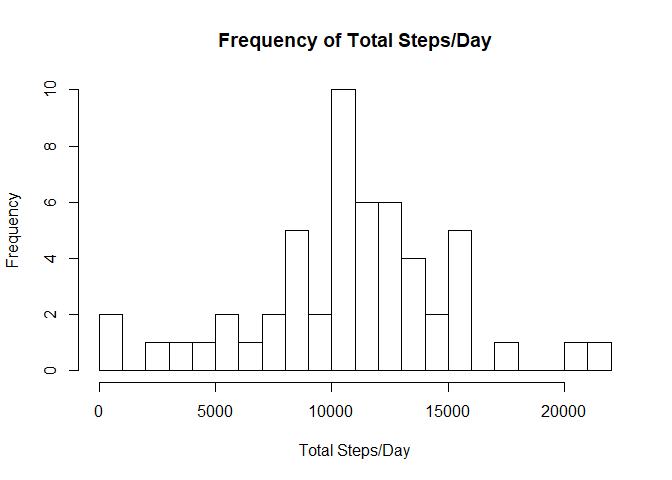
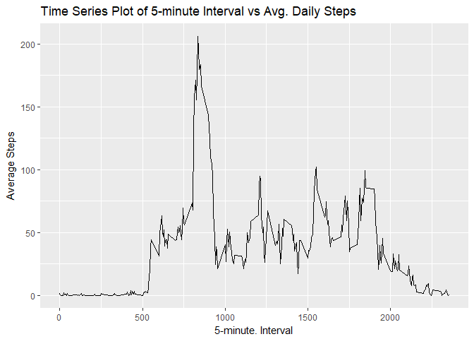
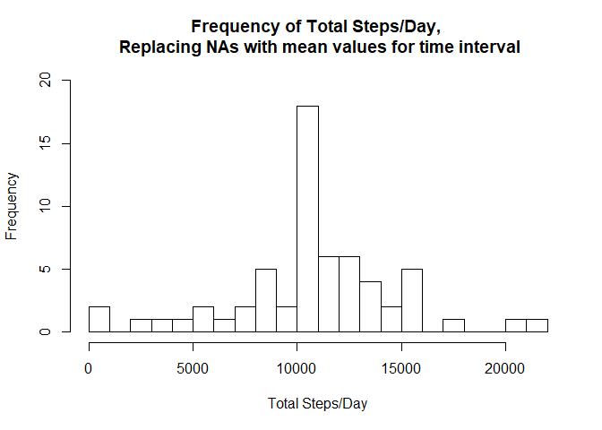
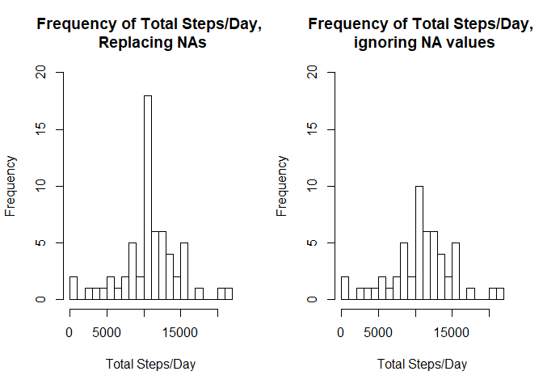
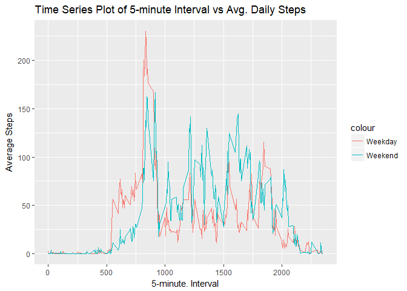

# Reproducible Research - Week 2 Assignment
S. Purvis  
November 10, 2017  


## Introduction

It is now possible to collect a large amount of data about personal movement using activity monitoring devices such as a Fitbit, Nike Fuelband, or Jawbone Up. These type of devices are part of the “quantified self” movement – a group of enthusiasts who take measurements about themselves regularly to improve their health, to find patterns in their behavior, or because they are tech geeks. But these data remain under-utilized both because the raw data are hard to obtain and there is a lack of statistical methods and software for processing and interpreting the data.  

This assignment makes use of data from a personal activity monitoring device. This device collects data at 5 minute intervals through out the day. The data consists of two months of data from an anonymous individual collected during the months of October and November, 2012 and include the number of steps taken in 5 minute intervals each day.  

Packages - These are the R Packages we need to complete the analysis

```r
library(tidyr)
library(dplyr)
library(data.table)
library(ggplot2)
library(lubridate)
```

## Importing Data

The dataset is stored in a comma-separated-value (CSV) file and there are a total of 17,568 observations in this dataset.  

The dataset contains a subset of variables from the original dataset:  
 - steps: Number of steps taking in a 5-minute interval (missing values are coded as NA)  
 - date: The date on which the measurement was taken in YYYY-MM-DD format  
 - interval: Identifier for the 5-minute interval in which measurement was taken  


```r
steps <- read.csv("activity.csv")
str(steps)
```

```
## 'data.frame':	17568 obs. of  3 variables:
##  $ steps   : int  NA NA NA NA NA NA NA NA NA NA ...
##  $ date    : Factor w/ 61 levels "2012-10-01","2012-10-02",..: 1 1 1 1 1 1 1 1 1 1 ...
##  $ interval: int  0 5 10 15 20 25 30 35 40 45 ...
```

## Data Cleaning

Data cleaning was restricted to coercing the date variable to date format


```r
steps <- steps%>% mutate(date = ymd(date))
str(steps)
```

```
## 'data.frame':	17568 obs. of  3 variables:
##  $ steps   : int  NA NA NA NA NA NA NA NA NA NA ...
##  $ date    : Date, format: "2012-10-01" "2012-10-01" ...
##  $ interval: int  0 5 10 15 20 25 30 35 40 45 ...
```

##Homework Questions

###Analyzing the number of steps perday

**1. Calculate the total number of steps taken per day**  

For this part of the assignment, ignore the missing values in the dataset.

```r
s1 <- steps%>% select(date, steps)%>% group_by(date)%>% summarise_all(funs(sum))
s1a <- round(mean(s1$steps, na.rm = TRUE),0)
```

There was a total of  10766 steps taken per day.    

**2. Make a histogram of the total number of steps taken each day**  

```r
hist(s1$steps, 
     breaks = 20, 
     xlab = "Total Steps/Day", 
     main = "Frequency of Total Steps/Day")
```

<!-- -->

**3. Calculate and report the mean and median of the total number of steps taken per day**  

```r
s1mean <- round(mean(s1$steps, na.rm = TRUE),0)
s1median <- median(s1$steps, na.rm = TRUE)
```

The mean number of steps/day = 10766 and the median number of steps/day = 10765.  

###What is the average daily activity pattern?

**1. Make a time series plot of the 5-minute interval (x-axis) and the average number of steps taken, averaged across all days (y-axis)**.  

```r
s2 <- steps%>% group_by(interval)%>%filter(!is.na(steps))%>% summarise(avgsteps = mean(steps))

ggplot(s2, aes(x=interval, y=avgsteps))+
  geom_line()+
  labs(x="5-minute. Interval", y="Average Steps")+
  ggtitle("Time Series Plot of 5-minute Interval vs Avg. Daily Steps")
```

<!-- -->

**2. Which 5-minute interval, on average across all the days in the dataset, contains the maximum number of steps?**


```r
s2.maxsteps <- round(s2[which.max(s2$avgsteps),]$avgsteps,1)
s2.maxsteps.interval <- s2[which.max(s2$avgsteps),]$interval
```

5-minute time interval at 835 minutes has an average of 206.2 steps.


###Imputing missing values

**1. Calculate and report the total number of missing values in the dataset (i.e. the total number of rows with NAs).**


```r
s3 <- steps%>%filter(is.na(steps))
s3.nas <- nrow(s3)
```
There are 2304 records with "NA" in the steps variable.  

**2. Devise a strategy for filling in all of the missing values in the dataset.**  

  - identify observations in starting dataframe (steps) where steps variable == NA
  - Replace these values with the mean of the number of steps per the 5 minute time interval

**3. Create a new dataset that is equal to the original dataset but with the missing data filled in.**  


```r
steps1 <- steps
steps1$steps <-ifelse(is.na(steps$steps),s2$avgsteps[s2$interval %in% steps$interval], steps$steps)
```

**4  Make a histogram of the total number of steps taken each day and Calculate and report the mean and median total number of steps taken per day.**  


```r
s4 <- steps1%>% select(date, steps)%>% group_by(date)%>% summarise_all(funs(sum))
hist(s4$steps, 
     breaks = 20, 
     xlab = "Total Steps/Day", 
     ylim = c(0,20),
     main = paste("Frequency of Total Steps/Day,", "\n", "Replacing NAs with mean values for time interval" ))
```

<!-- -->


**4a. Do these values differ from the estimates from the first part of the assignment? What is the impact of imputing missing data on the estimates of the total daily number of steps?** 


```r
par(mfrow=c(1,2))
hist(s4$steps, 
     breaks = 20, 
     xlab = "Total Steps/Day", 
     ylim = c(0,20),
     main = paste("Frequency of Total Steps/Day,", "\n", "Replacing NAs" ))
hist(s1$steps, 
     breaks = 20, 
     xlab = "Total Steps/Day",
     ylim = c(0,20),
     main = paste("Frequency of Total Steps/Day," , "\n","ignoring NA values"))
```

<!-- -->

**4b. Comparing mean and median before and after imputation of missing values.**  

```r
s4mean <- round(mean(s4$steps, na.rm = TRUE),0)
s4median <- round(median(s4$steps, na.rm = TRUE),0)
```
**4c Do these values differ from the estimates from the first part of the assignment?** 

Looking at the table below, mean and median value do not change
  

|           |   Mean   |   Median  |
|----------|----------|----------|
Ignoring NAs|10766|10765|
After Imputation|10766|10766|
  
**4d   What is the impact of imputing missing data on the estimates of the total daily number of steps?** 

Imputing missing data with the mean number of steps per the specific 5-minute interval had no impact on the on estimating the total daily steps.
  
  
###Are there differences in activity patterns between weekdays and weekends? 

**Create a new factor variable in the dataset with two levels – “weekday” and “weekend” indicating whether a given date is a weekday or weekend day.**  

```r
steps2 <- steps1%>% 
  mutate(dow = weekdays(date))%>% mutate(wdow = ifelse(dow =="Sunday"|dow == "Saturday","Weekend","Weekday")) %>%
  select(date, interval, steps, wdow)

str(steps2)
```

```
## 'data.frame':	17568 obs. of  4 variables:
##  $ date    : Date, format: "2012-10-01" "2012-10-01" ...
##  $ interval: int  0 5 10 15 20 25 30 35 40 45 ...
##  $ steps   : num  1.717 0.3396 0.1321 0.1509 0.0755 ...
##  $ wdow    : chr  "Weekday" "Weekday" "Weekday" "Weekday" ...
```

**Make a time series plot of the 5-minute interval (x-axis) and the average number of steps taken, comparing weekday days or weekend days (y-axis).**  


```r
s4.wdow <- steps2%>% group_by(wdow, interval)%>% summarise(avgsteps = mean(steps)) %>% spread(wdow,avgsteps)

ggplot(s4.wdow, aes(x=interval) ) +
  geom_line(aes( y=Weekday, color = "Weekday"))+
  geom_line(aes( y=Weekend, color = "Weekend"))+
  labs(x="5-minute. Interval", y="Average Steps")+
  ggtitle("Time Series Plot of 5-minute Interval vs Avg. Daily Steps")
```

<!-- -->


